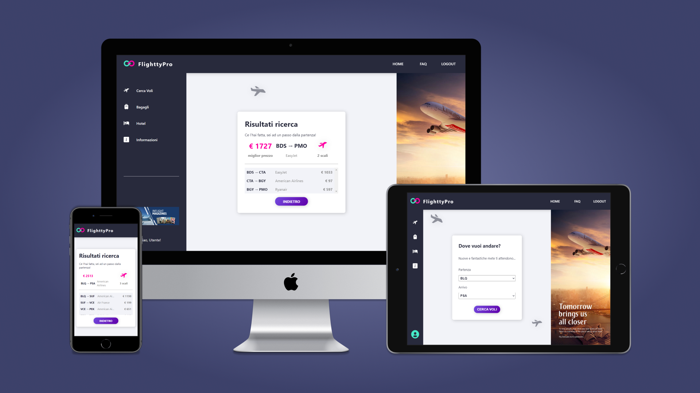
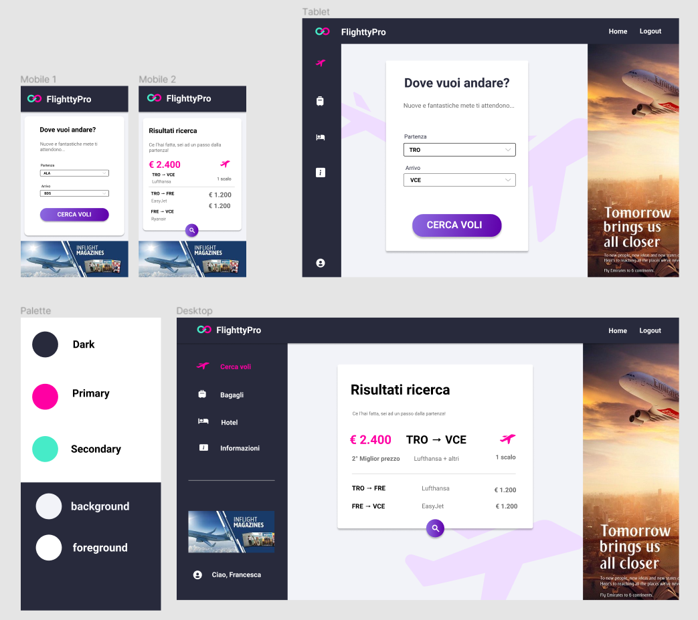
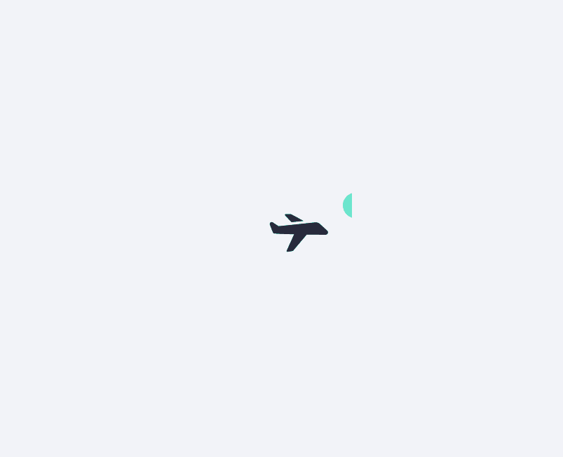
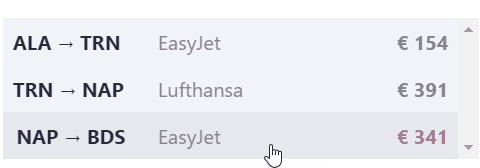
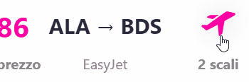
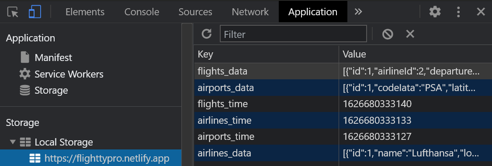
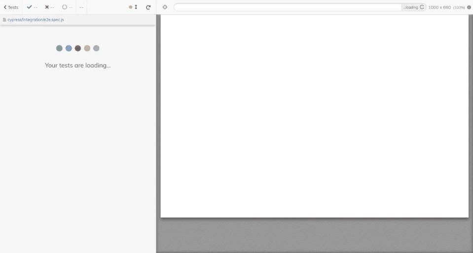
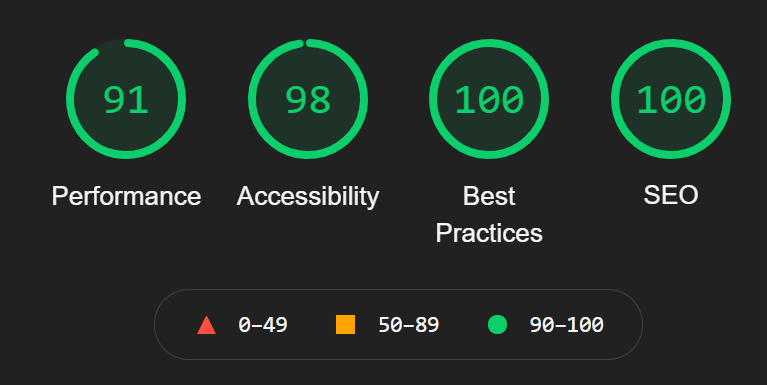

<h1>FlighttyPro ✈ </h1>

<p>
  <a href="https://www.typescriptlang.org/">
    
  </a>
  <a href="https://reactjs.org/">
    
  </a>
  <a href="https://sass-lang.com/">
    
  </a> 
  <a href="https://www.cypress.io/">
    
  </a> 
  <a href="https://flighttypro.netlify.app/">
    
  </a>
</p>

**Single Page Application** that shows you the **cheapest flights** between two italian airports (stop-overs included).

It uses the [ShippyPro Flight Engine API](https://react-dev.recruitment.shippypro.com/) to fetch airports, airlines and flights data.

Need a vacation? [Explore now!](https://flighttypro.netlify.app/) 👈

<a href="https://flighttypro.netlify.app/" title="Explore now!">
  
</a>

> 🌐 [Website](https://flighttypro.netlify.app/)

A **solo project** built in **1 week** as a coding challenge given by [ShippyPro](https://www.shippypro.com/) during the interview process.

## Features 💡

### Responsive 📱💻

The **mocks** were designed in [Figma](https://www.figma.com/) with a **mobile-first** approach and support phones, tablets and desktops.



### Interactive 🎯

**User experience** is taken very seriously providing several **microinteractions** to guide and delight visitors during the flow.



<p>
  
  
  
</p>

### Fast ⚡

A **caching layer** based on [local storage](https://developer.mozilla.org/en-US/docs/Web/API/Window/localStorage) improves the overall **performance**, making API calls less frequent.



### Tested 🛡

Reliability is granted by **e2e tests** done with [Cypress](https://www.cypress.io/).



### Solid 🧱

The app's **quality** is cheked against various [Lighthouse](https://developers.google.com/web/tools/lighthouse) audits run on the desktop version



## Future plans 💭

This app is still in active development, here are **some ideas** I'm working on:

- [ ] **Internationalization**
- [ ] **4K screens support**

## Tech Stack 🛠

**Built with** [Typescript](https://www.typescriptlang.org/), [React](https://reactjs.org/), and [Sass](https://sass-lang.com/). API calls made with [Axios](https://www.npmjs.com/package/axios) and animations with [GSAP](https://greensock.com/gsap/). E2E tests powered by [Cypress](https://www.cypress.io/). **Deployed** on [Netlify](https://www.netlify.com/).

<!-- front end stack logos -->

<p>
  
    
  
  
  
  
  
</p>

## Contributing 🤝

First step is to **clone** this project

```bash
$ git clone https://github.com/vikvikvr/flightty-pro.git
$ cd flightty-pro
```

Get an **API token** from the [ShippyPro team](mailto:developer@shippypro.com).

```bash
$ cp .env.example .env
$ npm install
$ npm start
```

Happy hacking and remember: **PRs are welcome**! 😄
